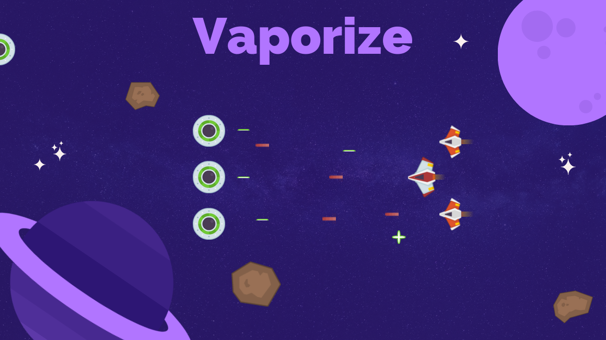
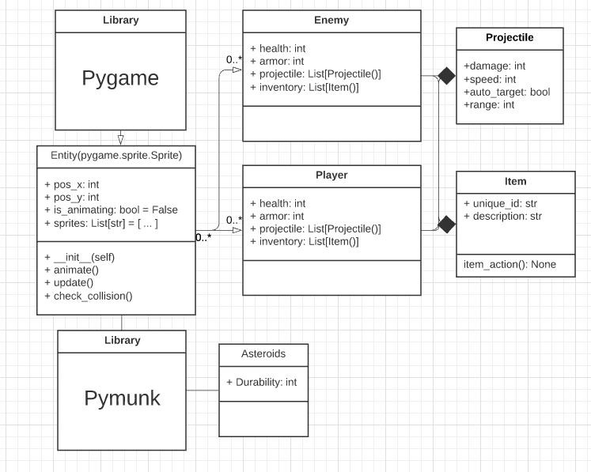

# What is it?
Vaporize is a 2D spaceship fighting RPG with various enemies, objectives and multiplayer fun. Created with pygame, pymunk and various python libraries.

## UML

## Libraries used
- https://www.pygame.org/news 
- http://www.pymunk.org/en/latest/ (2D Physics)

## Credits
Game Assets - https://kenney.nl/
